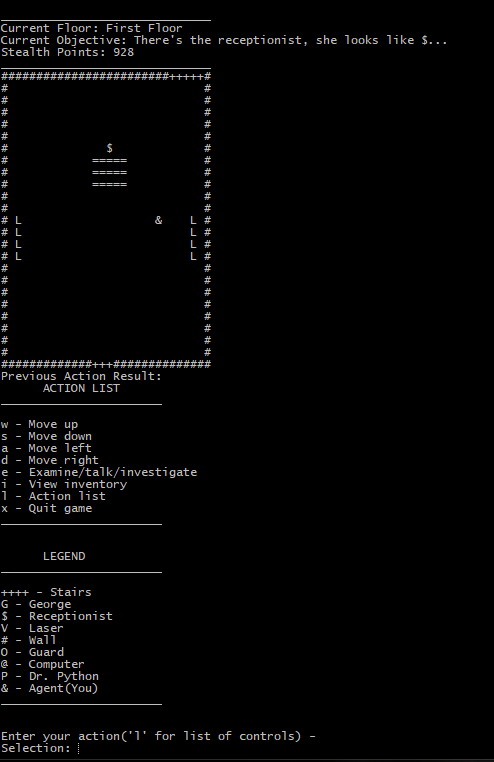

# C++ Agent

The game uses a 2D array to display various rooms the player can navigate through to accomplish the objective. Each room has a different objective and solution. Every player action updates the room, for example moving up will clear the screen and print a new room where the player is now one step higher.

The program utilizes aspects of polymorphism, inheritance, classes, memory management, decision making and basic programming fundamentals to operate.

How to play - 
1. From the command line enter: git clone https://github.com/hso4/C-Linux-Game.git
2. Run "make" to create the executable
3. Enter "./runGame"
4. For more fun, try to pick the wrong dialogue choices!

# Gameplay screenshot:

